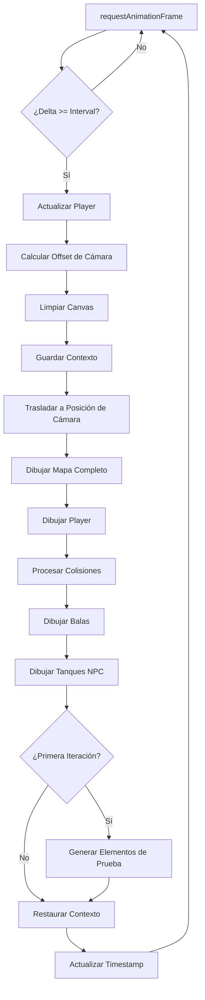

# Diagrama de Flujo del Game Loop

## Arquitectura General del Juego

```
INICIO DEL JUEGO
       ↓
Carga de Assets (preloadImages)
       ↓
Inicialización de Instancias
(Game, Player, Hud, MapCanvas)
       ↓
GAME LOOP (60 FPS)
```

## Game Loop Detallado



## Funciones del Game Loop

### 1. Control de FPS
- Utiliza `timestamp` del navegador
- Calcula delta time entre frames
- Mantiene 60 FPS objetivo

### 2. Actualización de Lógica
- `player.update()`: Movimiento, rotación, disparos
- Cálculo de offset de cámara para seguimiento del jugador
- Procesamiento de físicas y colisiones

### 3. Renderizado
- Limpieza del canvas
- Transformación de cámara (translate)
- Dibujo por capas: mapa → jugador → balas → NPCs

### 4. Elementos Especiales
- En primera iteración: genera tanques y balas de prueba
- Inicializa timers del HUD

## Componentes del Sistema

### Player (Tank)
```
update() Flow:
- Calcular velocidad y dirección
- Verificar límites del mapa
- Procesar input de teclado
- Gestionar cooldown de disparos
- Crear nuevas balas si corresponde
```

### Game
```
hits() Flow:
- Iterar todas las balas activas
- Verificar colisión con jugador (bounding box)
- Aplicar daño y reproducir sonido
- Remover bala del array
```

### Bullets Array
```
Management:
- Filtrar balas fuera de límites
- Actualizar posición de cada bala
- Renderizar todas las balas activas
```

## Estados del Juego

1. **Menú Principal**: Creación/unión a salas
2. **Esperando Jugadores**: Modal de carga
3. **Juego Activo**: Game loop ejecutándose
4. **Game Over**: Pendiente de implementación

## Optimizaciones

- **Canvas virtual**: Mapa de 10000x10000 renderizado una vez
- **Cámara**: Solo renderiza la porción visible
- **Filtrado**: Balas fuera de pantalla se eliminan
- **60 FPS**: Control preciso con delta timing

## Consideraciones de Rendimiento

- El mapa gigante se genera proceduralmente al inicio
- Las balas se filtran para evitar procesamiento innecesario
- El HUD se actualiza en intervalos separados (300ms)
- Primera iteración incluye generación de elementos de test